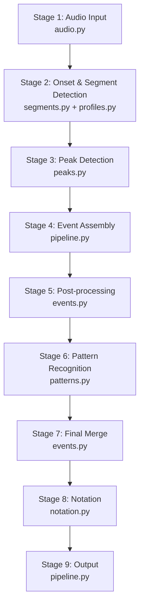

# Architecture

ブラウザ録音とサーバーサイド分析による、カリンバ演奏の楽譜化パイプライン。

## 全体構成

1. ブラウザが `MediaRecorder` で音声を録音する
2. UI が録音ファイルと選択されたチューニングを `POST /api/transcriptions` にアップロードする
3. FastAPI サービスが 9 ステージのパイプラインで音声を分析し、共有スコアモデルを返す
4. UI が共有モデルから 3 種の記譜ビュー（Do-Re-Mi / 番号 / 西洋）を描画し、イベント単位の軽量編集を提供する

## パイプライン構成

### Stage 1: Audio Input (`audio.py`)

WAV 読み込み、モノラル変換、DC 除去、ピーク正規化。入力音声をパイプラインが扱える形に整える。

### Stage 2: Onset & Segment Detection (`segments.py` + `profiles.py`)

librosa の RMS エネルギー・onset strength を使い、active range（演奏区間）を検出。onset detection は pure-numpy の `_peak_pick_numpy`（librosa `__peak_pick` からの移植、ISC License）+ backtrack で実装。テンポ推定は pure-numpy autocorrelation (`_estimate_tempo_autocorr`) で `librosa.beat.beat_track` を置換済み (2026-04-16 #187)。active range 内の onset を segment（分析単位）に分割する。`profiles.py` が onset の attack profile を検証し、gap 区間のノイズ onset をフィルタリングする。`per_note.py` が gap 区間の mute-dip rescue および gap-rise rescue (2026-04-16 #186) で broadband が見逃した re-attack / 新規 attack を per-note シグナルで補完する。

### Stage 3: Per-Segment Peak Detection (`peaks.py`)

セグメントごとに FFT を実行し、チューニング定義に基づいて candidate をスコアリング（`rank_tuning_candidates`）。primary → secondary → tertiary の順に候補を選出する。octave alias 解消、evidence gate（`onset_gain`, `backward_attack_gain`）、lower-mixed-roll extension 等の局所判定を含む。

### Stage 4: Event Assembly (`pipeline.py` ループ)

segment と選出された candidate から `RawEvent` を組み立てる。直前イベントの文脈情報（`recent_note_names`, `ascending_run_ceiling` 等）を蓄積し、sparse gap tail のフィルタリングを行う。

### Stage 5: Post-processing (`events.py`)

27 の suppress / collapse / merge / simplify 関数をチェーンで逐次適用。共鳴キャリーオーバー除去、gliss cluster マージ、residual tail 除去、octave pair 分割など、raw event を音楽的に妥当なイベント列に整形する。

### Stage 6: Pattern Recognition (`patterns.py`)

repeated pattern pass による正規化（four-note chord, triad, gliss パターン）と、upper echo mixed cluster の除去。各 pass は ablation フラグで個別に無効化可能。

### Stage 7: Final Merge (`events.py`)

adjacent event merge の最終パス、ascending run 内の dyad split。Stage 5-6 の結果に対する仕上げ。

### Stage 8: Notation (`notation.py`)

イベントの timing を beat grid に量子化し、Do-Re-Mi / 番号 / 西洋記譜の 3 ビューを生成する。

### Stage 9: Output (`pipeline.py`)

`ScoreEvent` の組み立て（gesture 分類を含む）と `TranscriptionResult` のパッケージング。

## モジュール一覧

`apps/api/app/transcription/` 配下のモジュール:

| モジュール | 責務 |
|------------|------|
| `audio.py` | WAV 読み込み・正規化 |
| `segments.py` | onset 検出、active range、segment 構築 |
| `profiles.py` | onset attack profile 検証、gap onset フィルタ |
| `peaks.py` | FFT、candidate ranking、primary/secondary/tertiary 選出 |
| `events.py` | post-processing 関数群（suppress/collapse/merge/split） |
| `patterns.py` | repeated pattern 正規化、echo 除去 |
| `notation.py` | beat 量子化、3 種記譜ビュー生成 |
| `pipeline.py` | パイプライン統合（`transcribe_audio` エントリポイント） |
| `models.py` | 内部データモデル（`RawEvent`, `NoteCandidate`, `Segment` 等） |
| `constants.py` | 定数定義 |
| `settings.py` | 設定値 |

## 関連ドキュメント

- [free-performance-readiness.md](free-performance-readiness.md) — 各 Stage の Free Performance（楽譜知識なしの自由演奏転写）適合度評価
- [browser-migration-analysis.md](browser-migration-analysis.md) — ブラウザサイド実装への移植分析
- [recognizer-local-rules.md](recognizer-local-rules.md) — fixture-specific ルールの一覧と debt 管理
- [recognition-roadmap.md](recognition-roadmap.md) — 認識精度の現状とロードマップ
